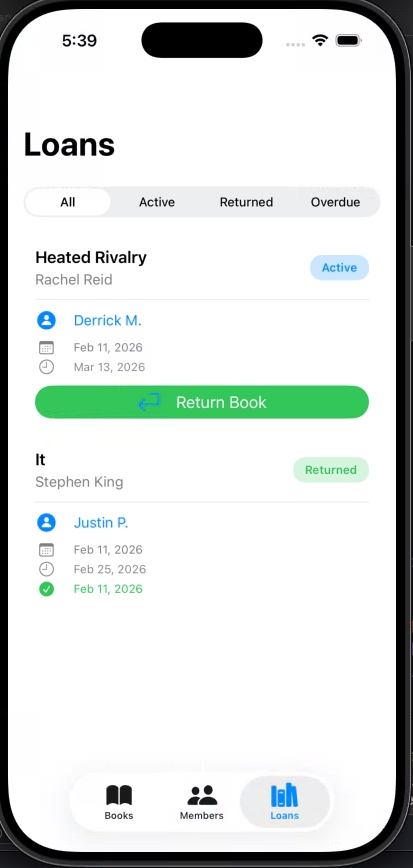

# LibraryTracker
A SwiftUI-based iOS application for managing a campus library system. Track books, members, and loans with an intuitive interface built with Core Data.

## ✨ Features

- **Book Management**: Add, edit, and categorize books with ISBN tracking
- **Member Management**: Register library members with email and join dates
- **Loan System**: Borrow and return books with due date tracking
- **Search & Filter**: Find books by title, author, or category
- **Overdue Tracking**: Visual indicators for overdue loans
- **Category Organization**: Organize books by genre (Romance, Fantasy, Horror, etc.)

### Core Data Model

The app uses Core Data with the following entities:

- **Book**: id, title, author, isbn (optional), addedAt, isAvailable, category
- **Member**: id, name, email, joinedAt
- **Category**: id, name
- **Loan**: id, borrowedAt, dueAt, returnedAt (optional), status (optional)

## 📱 Screenshots

### Books View

*Browse and search through the library's book collection with category filters*

### Members View

*View all library members with their active loan counts*

### Borrow Book Screen

*Select books and set loan durations when borrowing for members*

### Loans View

*Track all loans with filtering options for active, returned, and overdue items*

## 🤝 Contributing

This is a student project for educational purposes. Feel free to fork and modify for your own learning!

## 📄 License

This project is available for educational purposes.

## 👨‍💻 Author

**Justin Pescador**  
Created: February 2026
